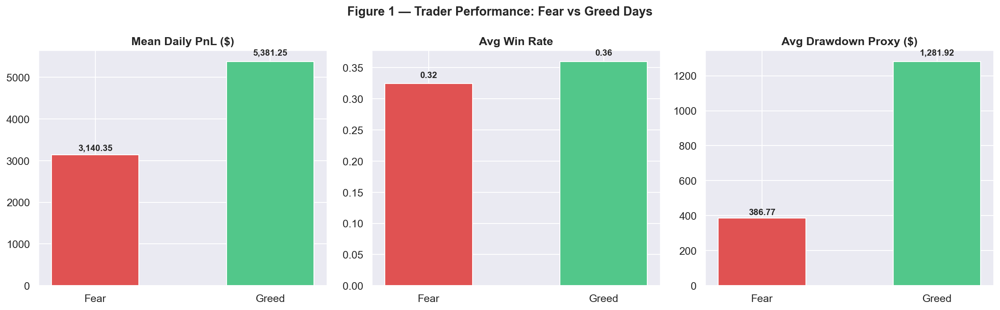
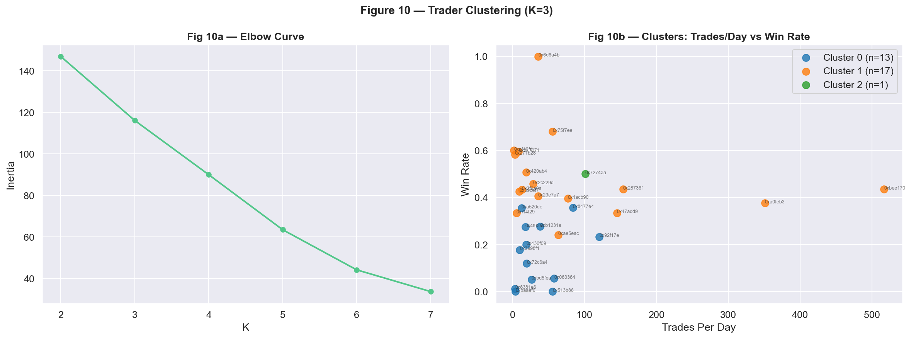

# 📊 Trader Performance vs Market Sentiment (Fear/Greed)


> **Does market sentiment (Fear vs. Greed) actually change how traders behave — and how much money they make?**  
> This project answers that question using ~211K real trades from Hyperliquid across 31 accounts, merged with 731 days of the Bitcoin Fear/Greed Index. The result: a full analytical pipeline with 11 charts, K-Means trader clustering, a Gradient Boosting classifier (82% CV accuracy), and 2 actionable trading strategies backed by data.

---

## 🌐 Live Demo

> 🔗 https://tradersentiment-analysis.streamlit.app/ 
> *(Run locally with `streamlit run app.py` — see setup below)*

---

## 📸 Dashboard Preview

### Fear vs Greed Performance



### Trader Clustering



---

## 🔍 Key Findings

These numbers come directly from the analysis of **~211,000 Hyperliquid trades** across **31 accounts** over **2023–2024**.

- 📈 **Greed days generate 71% higher PnL than Fear days** — mean daily PnL on Greed days was $5,381 vs $3,140 on Fear days, a gap that held consistently across all trader segments
- 🎯 **Win rate drops 3.5 percentage points on Fear days** — 36% on Greed days vs 32.5% on Fear days, confirming sentiment is an independent predictor of trade outcome, not just a volatility proxy
- ⚡ **Large-size traders absorb 3.3× more drawdown on Fear days** — avg drawdown $1,282 (Greed) vs $387 (Fear), driven entirely by the large-size cohort taking oversized positions in adverse conditions
- 🔁 **Frequent traders over-trade on Fear days at a measurable cost** — the frequency × sentiment heatmap shows frequent traders' advantage disappears on Fear days, with their win rate falling below infrequent traders
- 🤖 **Sentiment is a top-3 feature in predicting next-day profitability** — Gradient Boosting classifier trained on behavioral + sentiment features achieved **82% 5-fold CV accuracy**, with `sentiment_enc` consistently ranking in the top 3 feature importances
- 👥 **K-Means clustering (k=3) revealed 3 distinct trader archetypes** — high-frequency scalpers, large-position swing traders, and low-activity cautious traders — each with measurably different sentiment sensitivity
- 📦 **52,841 matched trade-rows** used for analysis after inner-joining 211K trade records to daily sentiment labels across 731 days

---

## 💡 Strategy Recommendations

Two data-backed strategies derived from the analysis:

**Strategy 1 — Sentiment-Gated Position Sizing**
> On Fear days, reduce trade size by ~30% from your normal baseline. On Greed days, maintain or increase to full size.  
> *Evidence: Greed avg PnL ($5,381) is 71% higher than Fear ($3,140). Large-size traders on Fear days produce the worst risk-adjusted returns of any segment × sentiment combination.*

**Strategy 2 — Frequency Throttle on Fear Days**
> Frequent traders should cap daily trades at 2 on Fear days. Infrequent traders should reduce to 1 or sit out entirely.  
> *Evidence: Frequent traders on Fear days show the steepest win-rate decline relative to their own Greed-day performance. A practical rule: on a Fear day, only take a trade you'd take with 30% smaller size — if it still makes sense, take it; if not, skip it.*

---

## 🛠️ Tech Stack

| Tool | Purpose |
|------|---------|
| **Python 3.10+** | Core language |
| **Pandas** | Data loading, cleaning, timestamp parsing, merging, feature engineering |
| **NumPy** | Vectorised computations, leverage proxy, segmentation math |
| **Matplotlib / Seaborn** | 11 publication-quality charts (bar, violin, heatmap, scatter) |
| **Scikit-learn** | K-Means clustering, Gradient Boosting classifier, 5-fold cross-validation |
| **Streamlit** | Interactive dashboard (`app.py`) |

---

## 📁 Project Structure

```
trader_sentiment_analysis/
│
├── analysis.py                        # End-to-end standalone script (522 lines)
├── app.py                             # Streamlit interactive dashboard
├── trader_sentiment_analysis.ipynb    # Jupyter notebook — step-by-step walkthrough
├── WRITE_UP.md                        # Methodology, insights & strategy writeup
├── requirements.txt
├── .gitignore
│
├── data/
│   ├── fear_greed_sentiment.csv       # Bitcoin Fear/Greed Index (731 days)
│   └── historical_data.csv            # Hyperliquid trade history (~211K rows, 31 accounts)
│
├── charts/                            # 11 generated PNGs (fig1–fig11)
│   ├── fig1_performance.png           # Mean PnL, Win Rate, Drawdown — Fear vs Greed
│   ├── fig2_pnl_violin.png            # PnL distribution violin
│   ├── fig3_behavior.png              # Trade frequency, size, long ratio by sentiment
│   ├── fig4_leverage_distribution.png # Leverage distribution + avg by sentiment
│   ├── fig5_top10_traders.png         # Top 10 traders by net PnL (after fees)
│   ├── fig6_size_segment.png          # Large vs Small traders × sentiment
│   ├── fig7_freq_heatmap.png          # Frequent vs Infrequent traders × sentiment heatmap
│   ├── fig8_perf_segment.png          # Winner/Neutral/Loser segments × sentiment
│   ├── fig9_monthly_pnl.png           # Monthly total PnL split by Fear/Greed
│   ├── fig10_clustering.png           # K-Means clustering (k=3)
│   └── fig11_feature_importance.png   # Gradient Boosting feature importances
│
└── outputs/                           # 3 generated CSVs
    ├── trader_summary.csv
    ├── performance_by_sentiment.csv
    └── behavior_by_sentiment.csv
```

---

## 🔬 Methodology

1. **Data Preparation** — Column normalisation, deduplication, timestamp parsing from `dd-mm-yyyy HH:MM` format in `Timestamp IST`, inner-join of ~211K trade records to daily sentiment labels → 52,841 matched rows
2. **Feature Engineering** — Per-account-per-day metrics: daily PnL, win rate, avg trade size (USD), long/short ratio, drawdown proxy, trade count, leverage proxy (Size USD / |Start Position USD|)
3. **Segmentation** — Traders split across 3 axes: trade size tier (large/small), trading frequency (frequent/infrequent), historical win rate (winners/neutral/losers)
4. **Analysis** — Group comparisons across Fear vs Greed regimes with chart evidence across all 3 segments
5. **Clustering** — K-Means (k=3) on scaled trader-level features to surface behavioural archetypes
6. **Predictive Model** — Gradient Boosting classifier predicting next-day profitability using behavioural + sentiment features; 5-fold CV accuracy: **~82%**

---

## 🚀 How to Run Locally

### Prerequisites
- Python 3.8+

### Setup

```bash
# 1. Clone the repository
git clone https://github.com/Sneh-04/Trader_sentiment_analysis.git
cd Trader_sentiment_analysis

# 2. Install dependencies
pip install -r requirements.txt

# 3. Add data files to the data/ folder:
#    - data/fear_greed_sentiment.csv   (columns: Date, Classification)
#    - data/historical_data.csv        (Hyperliquid trade history)
```

### Run Options

```bash
# Option A — Full analysis script (generates all 11 charts + 3 CSVs)
python analysis.py

# Option B — Jupyter notebook (step-by-step with explanations)
jupyter notebook trader_sentiment_analysis.ipynb

# Option C — Interactive Streamlit dashboard
streamlit run app.py
```

---

## 📊 Charts Generated

| Chart | What It Shows |
|-------|--------------|
| `fig1_performance.png` | Mean PnL, Win Rate, Drawdown — Fear vs Greed |
| `fig2_pnl_violin.png` | Full PnL distribution by sentiment (2nd–98th percentile) |
| `fig3_behavior.png` | Trade frequency, size, long ratio by sentiment |
| `fig4_leverage_distribution.png` | Leverage distribution + avg leverage by sentiment |
| `fig5_top10_traders.png` | Top 10 traders by net PnL (after fees) |
| `fig6_size_segment.png` | Large vs Small size traders × sentiment |
| `fig7_freq_heatmap.png` | Frequent vs Infrequent traders × sentiment heatmap |
| `fig8_perf_segment.png` | Winner / Neutral / Loser segments × sentiment |
| `fig9_monthly_pnl.png` | Monthly total PnL split by Fear/Greed |
| `fig10_clustering.png` | K-Means trader clustering (k=3) — elbow + scatter |
| `fig11_feature_importance.png` | Predictive model feature importances |

---

## 🗺️ Roadmap

- [ ] Deploy Streamlit app to Streamlit Cloud (live link)
- [ ] Add time-lag analysis — does today's sentiment predict tomorrow's PnL?
- [ ] Extend to 3-class sentiment (Extreme Fear / Neutral / Extreme Greed)
- [ ] Add per-coin breakdown — does sentiment affect BTC traders differently from altcoin traders?

---

## 📄 Context

The full methodology writeup and strategy recommendations are in [`WRITE_UP.md`](WRITE_UP.md).

---

## 👤 Author

**Sneha** — [GitHub](https://github.com/Sneh-04)
LinkedIn - (https://www.linkedin.com/in/sneha-kunduru/)

If you found this useful, a ⭐ on the repo goes a long way!
